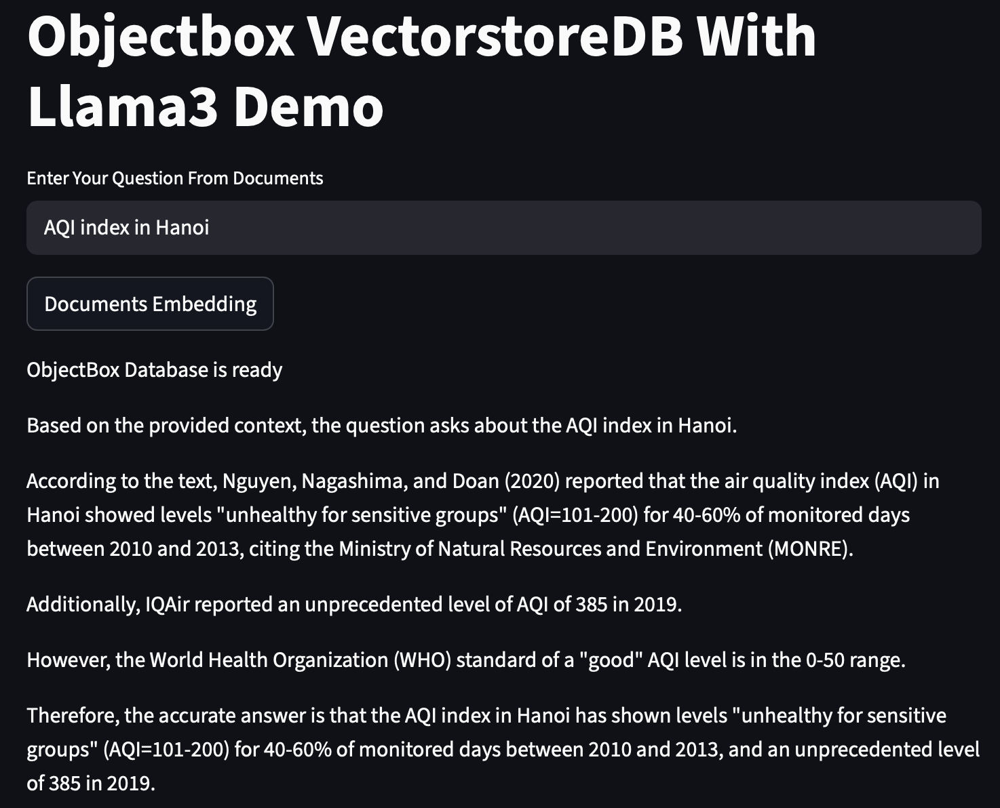

# RAG_objectbox_langchain
Create a Retrieval Augmented Generation (RAG) app using ObjectBox and LangChain.

## Install required packages
Install packages in *requirements.txt*

## Run the application

```bash
streamlit run app.py
```



## Reference
https://www.youtube.com/watch?v=9LewL1bUS6g
